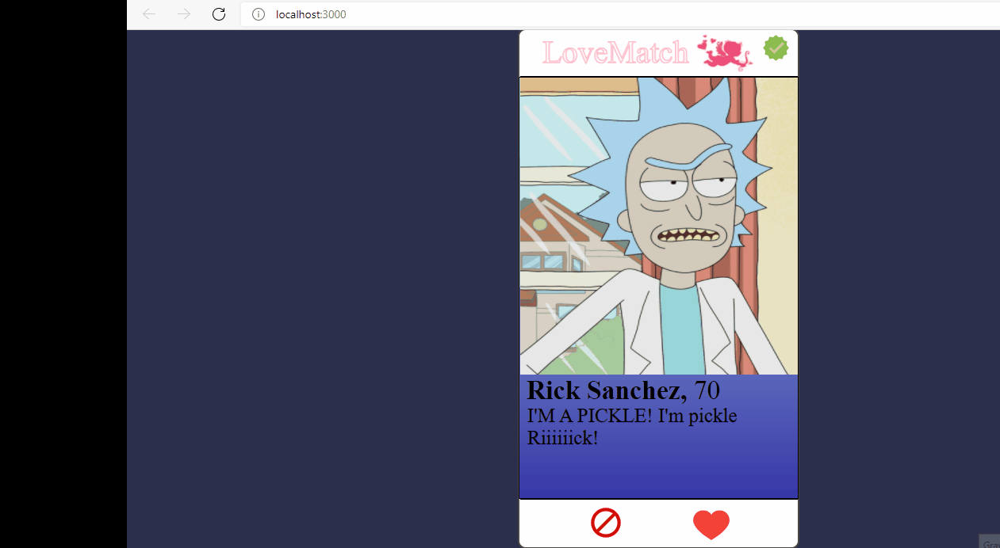

  # LoveMatch
  
link do surge:   <a href="http://exultant-cushion.surge.sh/">  LoveMatch</a>

  
Projeto com funcionalidades  básicas similares do Tinder utilizando a API  da

###( [Labenu 🥰]Labenu(http://www.labenu.com.br/)

 
 
  

 
 

### Features

- [x] Like ou Dislike
- [x] Ver Lista de matchs
- [x] Excluir Lista
- [x] Voltar para Home

 
 

## 🛠 Tecnologias

<code></code>](https://reactjs.org/docs/getting-started.html)
[<code></code>](https://nodejs.org/en/docs/)
[<code></code>](https://expressjs.com/en/4x/api.html)
- [Javascript](https://developer.mozilla.org/pt-BR/docs/Web/JavaScript)
- [CSS](https://developer.mozilla.org/pt-BR/docs/Web/CSS)
- [API REST](https://documenter.getpostman.com/view/7549981/SW12yx56?version=latest)

 
 
 Bruna Nunciato  💜

  

